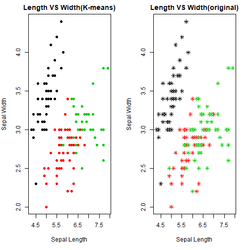
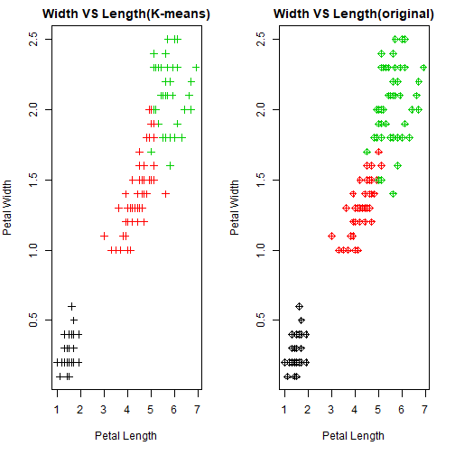

```r
knitr::opts_chunk$set(warning = FALSE)
```

## **1. Data and Libraries**

First we load the **required libraries** and the **iris dataset** required for the task.


```r
library(datasets)
library(ggplot2)
data(iris)
```

As the dataset has been loded in the system, we will look at the data now. We will call the **summary** function on the dataset **iris**.


```r
summary(iris)
```

```
##   Sepal.Length    Sepal.Width     Petal.Length    Petal.Width          Species  
##  Min.   :4.300   Min.   :2.000   Min.   :1.000   Min.   :0.100   setosa    :50  
##  1st Qu.:5.100   1st Qu.:2.800   1st Qu.:1.600   1st Qu.:0.300   versicolor:50  
##  Median :5.800   Median :3.000   Median :4.350   Median :1.300   virginica :50  
##  Mean   :5.843   Mean   :3.057   Mean   :3.758   Mean   :1.199                  
##  3rd Qu.:6.400   3rd Qu.:3.300   3rd Qu.:5.100   3rd Qu.:1.800                  
##  Max.   :7.900   Max.   :4.400   Max.   :6.900   Max.   :2.500
```

Now we will look at the dataset using the **head** function on the **iris** dataset.


```r
head(iris)
```

```
##   Sepal.Length Sepal.Width Petal.Length Petal.Width Species
## 1          5.1         3.5          1.4         0.2  setosa
## 2          4.9         3.0          1.4         0.2  setosa
## 3          4.7         3.2          1.3         0.2  setosa
## 4          4.6         3.1          1.5         0.2  setosa
## 5          5.0         3.6          1.4         0.2  setosa
## 6          5.4         3.9          1.7         0.4  setosa
```

Now looking at the **dim** fuction to check for the **dimenssions** of the **iris** dataset.


```r
dim(iris)
```

```
## [1] 150   5
```

We see that the dataset conatins **150 rows** and **5 columns**.

## **2. Preprocessing the Data**

We know that **Clustering is a type of Unsupervised Learning** so we do not need the **Species** columns of the **iris dataset**.


```r
iris_new <- iris[, c(1,2,3,4)]
specie <- iris[, "Species"]
head(iris_new)
```

```
##   Sepal.Length Sepal.Width Petal.Length Petal.Width
## 1          5.1         3.5          1.4         0.2
## 2          4.9         3.0          1.4         0.2
## 3          4.7         3.2          1.3         0.2
## 4          4.6         3.1          1.5         0.2
## 5          5.0         3.6          1.4         0.2
## 6          5.4         3.9          1.7         0.4
```

```r
table(specie)
```

```
## specie
##     setosa versicolor  virginica 
##         50         50         50
```

So as we can see that the **iris_new** dataset contains only **4 columns** now.

We do a bit of formatting of the dataset


```r
newfun <- function(x){
  return ((x-min(x))/(max(x)-min(x)))
}

iris_new$Sepal.Length<- newfun(iris_new$Sepal.Length)
iris_new$Sepal.Width<- newfun(iris_new$Sepal.Width)
iris_new$Petal.Length<- newfun(iris_new$Petal.Length)
iris_new$Petal.Width<- newfun(iris_new$Petal.Width)
head(iris_new)
```

```
##   Sepal.Length Sepal.Width Petal.Length Petal.Width
## 1   0.22222222   0.6250000   0.06779661  0.04166667
## 2   0.16666667   0.4166667   0.06779661  0.04166667
## 3   0.11111111   0.5000000   0.05084746  0.04166667
## 4   0.08333333   0.4583333   0.08474576  0.04166667
## 5   0.19444444   0.6666667   0.06779661  0.04166667
## 6   0.30555556   0.7916667   0.11864407  0.12500000
```

## **3. Clustering the Dataset**

This is a dataset in which we know that 3 centers are going to be appropriate for prediction.  
The R documentation tells us that the **k-means** method **"aims to partition the points into k groups such that the sum of squares from points to the assigned cluster centres is minimized."**  
We will use the **kmeans** function given in R for doing the **clustering**.


```r
result <- kmeans(iris_new, 3)
```

We will now look at the **result** variable


```r
result
```

```
## K-means clustering with 3 clusters of sizes 50, 61, 39
## 
## Cluster means:
##   Sepal.Length Sepal.Width Petal.Length Petal.Width
## 1    0.1961111   0.5950000   0.07830508  0.06083333
## 2    0.4412568   0.3073770   0.57571548  0.54918033
## 3    0.7072650   0.4508547   0.79704476  0.82478632
## 
## Clustering vector:
##   [1] 1 1 1 1 1 1 1 1 1 1 1 1 1 1 1 1 1 1 1 1 1 1 1 1 1 1 1 1 1 1 1 1 1 1 1 1 1 1 1 1 1 1 1 1 1 1 1 1 1 1 3 2 3 2 2 2 2
##  [58] 2 2 2 2 2 2 2 2 2 2 2 2 2 2 2 2 2 2 2 2 3 2 2 2 2 2 2 2 2 2 2 2 2 2 2 2 2 2 2 2 2 2 2 3 2 3 3 3 3 2 3 3 3 3 3 3 2
## [115] 3 3 3 3 3 2 3 2 3 2 3 3 2 2 3 3 3 3 3 2 2 3 3 3 2 3 3 3 2 3 3 3 2 3 3 2
## 
## Within cluster sum of squares by cluster:
## [1] 1.829062 3.079830 2.073324
##  (between_SS / total_SS =  83.0 %)
## 
## Available components:
## 
## [1] "cluster"      "centers"      "totss"        "withinss"     "tot.withinss" "betweenss"    "size"        
## [8] "iter"         "ifault"
```

We see that the clustering has been completed and we will now see the different aspects of the **kmeans clustering**


```r
names(result)
```

```
## [1] "cluster"      "centers"      "totss"        "withinss"     "tot.withinss" "betweenss"    "size"        
## [8] "iter"         "ifault"
```

So we see that there are **9 aspects** in the **result** variable. 


```r
table(specie, result$cluster)
```

```
##             
## specie        1  2  3
##   setosa     50  0  0
##   versicolor  0 47  3
##   virginica   0 14 36
```
 
So the **kmeans** was able to cluster **50 setosa**, **47 versicolor** and **36 virginica** which is fairly good.  Now we will plot these and compare it with the original plot to check if the clustering done is compareable or not.


```r
result$centers
```

```
##   Sepal.Length Sepal.Width Petal.Length Petal.Width
## 1    0.1961111   0.5950000   0.07830508  0.06083333
## 2    0.4412568   0.3073770   0.57571548  0.54918033
## 3    0.7072650   0.4508547   0.79704476  0.82478632
```

```r
result$cluster
```

```
##   [1] 1 1 1 1 1 1 1 1 1 1 1 1 1 1 1 1 1 1 1 1 1 1 1 1 1 1 1 1 1 1 1 1 1 1 1 1 1 1 1 1 1 1 1 1 1 1 1 1 1 1 3 2 3 2 2 2 2
##  [58] 2 2 2 2 2 2 2 2 2 2 2 2 2 2 2 2 2 2 2 2 3 2 2 2 2 2 2 2 2 2 2 2 2 2 2 2 2 2 2 2 2 2 2 3 2 3 3 3 3 2 3 3 3 3 3 3 2
## [115] 3 3 3 3 3 2 3 2 3 2 3 3 2 2 3 3 3 3 3 2 2 3 3 3 2 3 3 3 2 3 3 3 2 3 3 2
```
We make a plot between the **Sepal.Length** and **Sepal.Width** for the **original** as well as the **kmeans clustered** dataset to see if how they compare. 


```r
par(mfrow = c(1,2), mar = c(5, 4, 2, 2))
plot(iris$Sepal.Length, iris$Sepal.Width, col = result$cluster, xlab = "Sepal Length", ylab = "Sepal Width", main = "Length VS Width(K-means)", pch = 19)
plot(iris$Sepal.Length, iris$Sepal.Width, col = iris$Species,  xlab = "Sepal Length", ylab = "Sepal Width", main = "Length VS Width(original)", pch = 8)
```




We now make a plot for **Petal length** and **Petal Width** for the **original** and the **kmeans clustering** dataset to see how they compare.


```r
par(mfrow = c(1,2), mar = c(5, 4, 2, 2))
plot(iris$Petal.Length, iris$Petal.Width , col = result$cluster, xlab = "Petal Length", ylab = "Petal Width", main = "Width VS Length(K-means)", pch = 3)
plot(iris$Petal.Length, iris$Petal.Width, col = iris$Species,  xlab = "Petal Length", ylab = "Petal Width", main = "Width VS Length(original)", pch = 9)
```



## **4. Discussion**

1. So we see that the clustering is done quite effectively. We can see **3 proper clusters** in for each plots.
2. The **centers** and the **cluster** are also shown in the analysis.
3. As we know that the initial points and the initial number for the **clusters** are chosen **randomly**, so, the plotting can be more efficient **if the number of starting points are more**.
4. The error in clustering can be calculated by:  
   a. Total number of **correctly classified points** = 50+47+36 = 143
   b. Total number of **incorrect classifications** = 0+3+14 = 17
   c. **Accuracy in clustering** = (1-(17/143)) = 0.88 or **88%**
